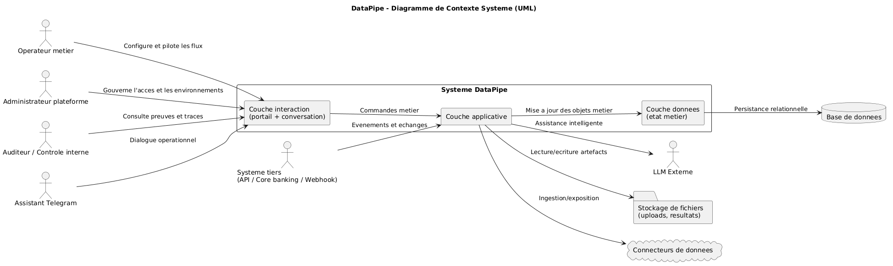
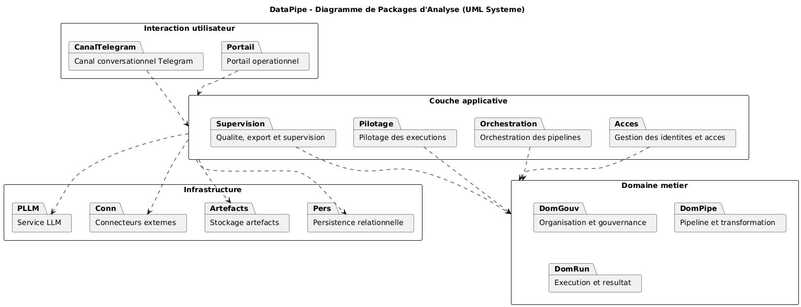
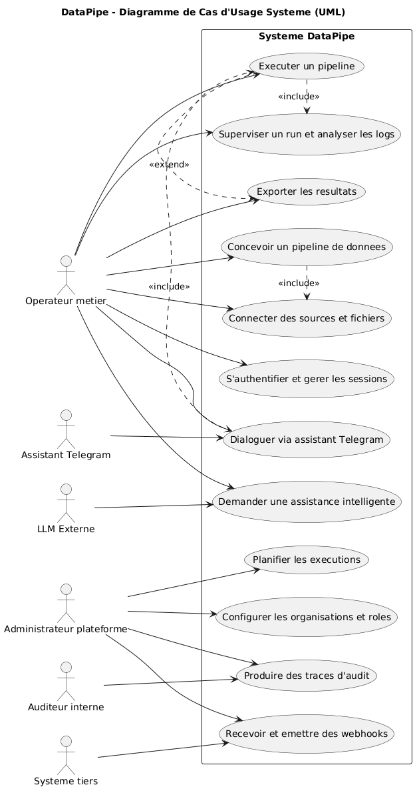
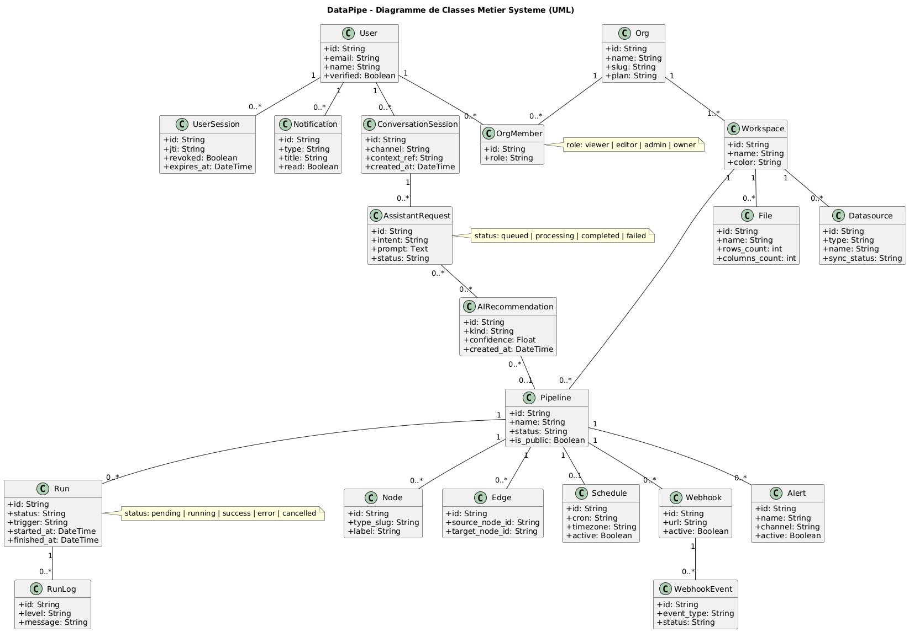
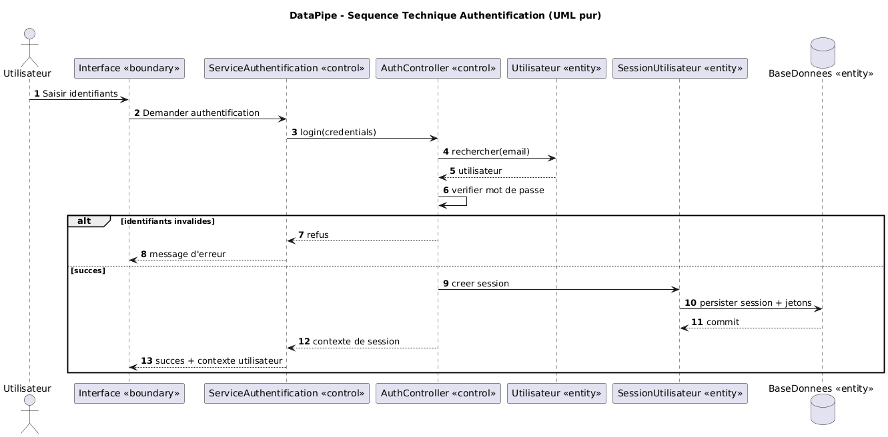
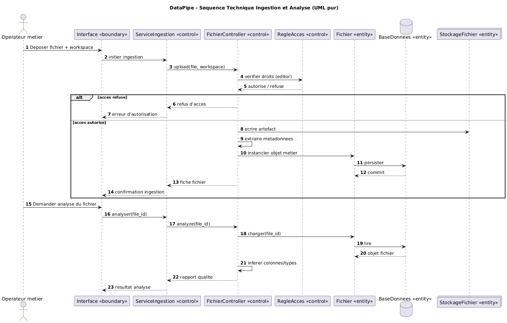
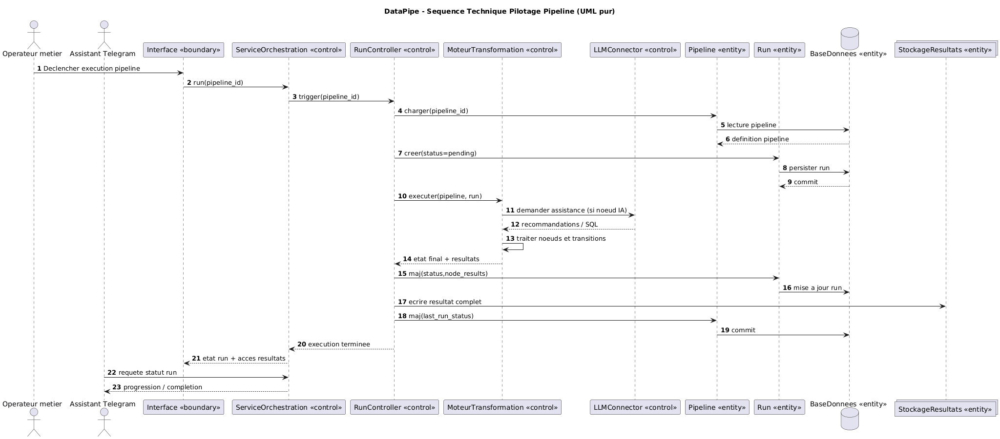
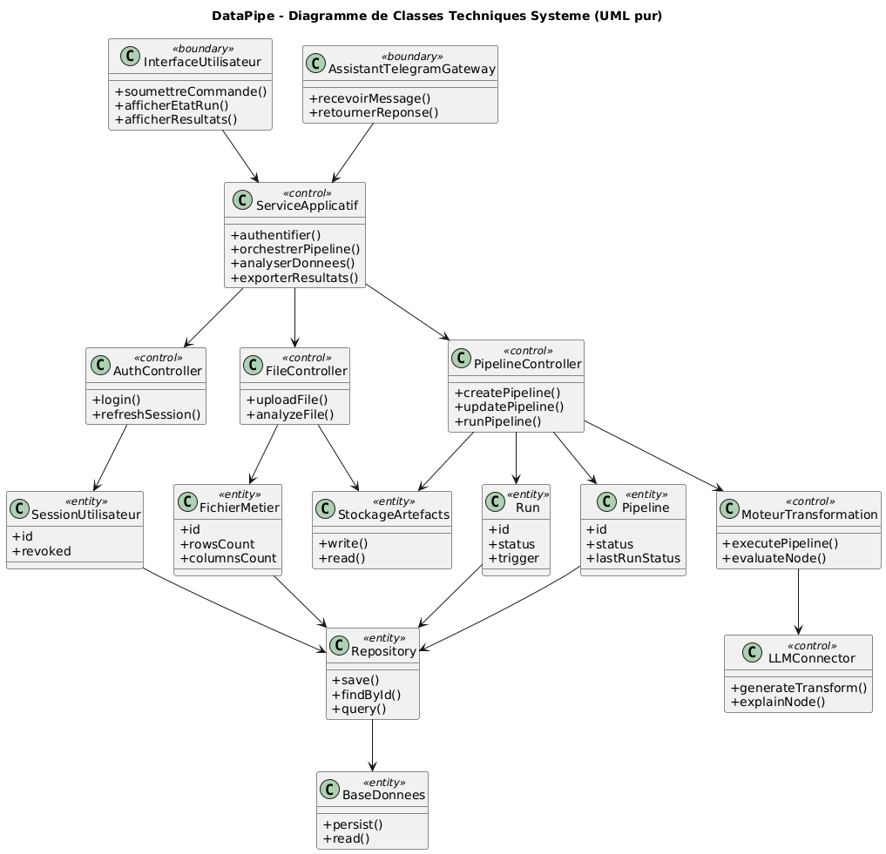
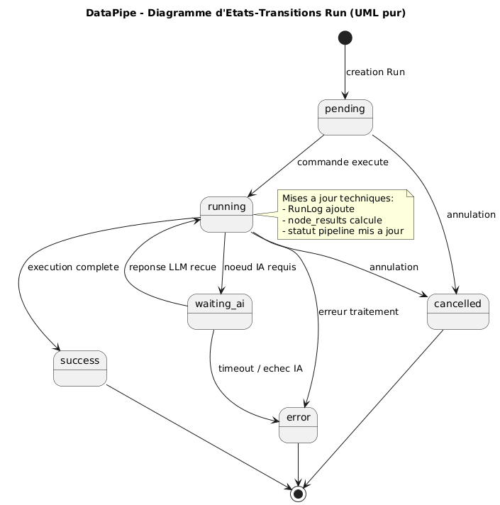
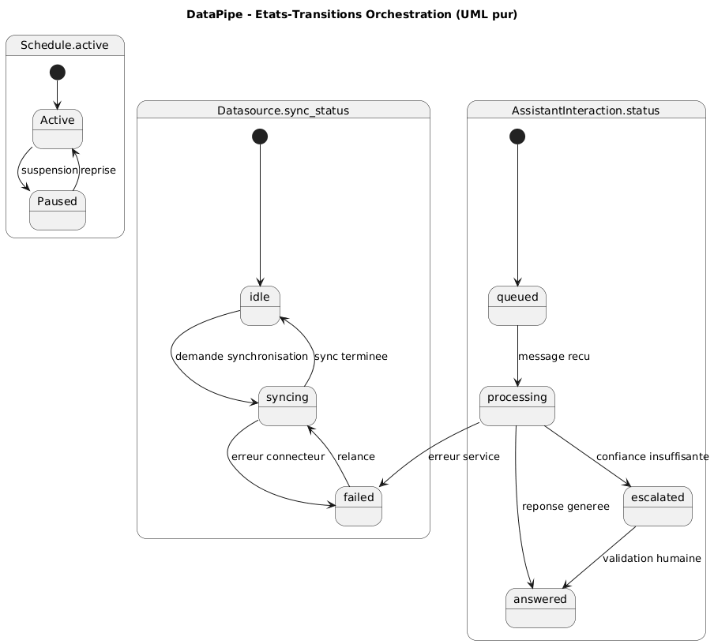

# Rapport academique d'analyse et de conception
## Systeme DataPipe - ETL visuel pour pipelines bancaires

### Introduction

Ce rapport presente la modelisation et la conception de DataPipe en vue systeme, avec une approche UML pure. L'architecture est decrite autour de la couche d'interaction, de la couche service, de la couche controle et des objets metier persistes en base. Le systeme integre explicitement un LLM externe et un assistant Telegram comme acteurs logiciels de premier plan.

### 1. Analyse du systeme

La phase d'analyse formalise le cadre global du systeme, ses acteurs, ses responsabilites et son noyau metier. Les vues suivantes sont les vues de reference.

#### 1.1 Diagramme de contexte systeme

Le diagramme de contexte positionne les acteurs humains et logiciels autour du systeme DataPipe, en explicitant les dependances vers la base de donnees, le stockage d'artefacts, les connecteurs externes, le LLM et le canal Telegram.

#### 1.2 Diagramme de packages d'analyse

Le diagramme de packages structure le systeme en blocs coherents et montre les dependances majeures entre interaction, services applicatifs, domaine metier et infrastructure.

#### 1.3 Diagramme de cas d'usage

Le diagramme de cas d'usage formalise les capacites attendues par les acteurs principaux. Il inclut les acteurs humains classiques, l'assistant Telegram et le LLM externe.

#### 1.4 Diagramme de classes metier

Le diagramme de classes metier expose les entites de gouvernance, d'orchestration, d'execution, d'assistance intelligente et de conversation operationnelle.

### 2. Conception technique UML pure

La phase de conception traduit l'analyse en interactions techniques detaillees. Les sequences suivent le schema exige interface, service, controleur et objets persistes.

#### 2.1 Sequence technique d'authentification

Le flux de connexion represente le parcours complet entre la commande utilisateur, la validation de service, le controle d'acces et la creation de session persistante.

#### 2.2 Sequence technique ingestion et analyse

Le flux d'ingestion et d'analyse montre la coordination entre interface, service d'ingestion, controle des droits, persistance de l'objet fichier et production du rapport d'analyse.

#### 2.3 Sequence technique d'execution pipeline

Le flux de run met en evidence l'orchestration du moteur de transformation, l'appel conditionnel au LLM, la mise a jour des objets `Pipeline` et `Run` et l'exposition de statut vers les canaux d'interaction.

#### 2.4 Diagramme de classes techniques

Le diagramme de classes techniques presente les stereotypes UML `boundary`, `control` et `entity` avec les dependances de la couche applicative.

#### 2.5 Diagramme d'etats-transitions du Run

Le cycle de vie du run formalise les transitions critiques, y compris l'etat d'attente d'assistance IA.

#### 2.6 Diagramme d'etats-transitions d'orchestration

Ce diagramme formalise la dynamique des schedules, de la synchronisation datasource et de l'interaction conversationnelle assistee.

### 3. Coherence architecture et valeur metier

L'ensemble des vues UML montre un systeme coherent dans lequel la gouvernance des acces, l'execution des pipelines, la supervision operationnelle et l'assistance intelligente sont articulees sans ambiguite. La separation des responsabilites entre interface, service, controle et objets persistes facilite la maintenabilite, la testabilite et l'auditabilite.

### 4. Lien avec le modele economique

Le modele economique complet, contextualise pour le Cameroun, est disponible dans `docs/modele_economique_datapipe_cameroun.md`. Ce document contient les tableaux de revenus, segmentation, unit economics, scenarios financiers, plan de financement trimestriel et gestion des risques.

### Conclusion

La refonte en UML pure confirme que DataPipe est un systeme applicatif complet et non une simple exposition d'endpoints. L'integration explicite du LLM et de l'assistant Telegram dans les vues d'analyse et de conception renforce la qualite de modelisation et la pertinence de la proposition technique pour le defi 9.
